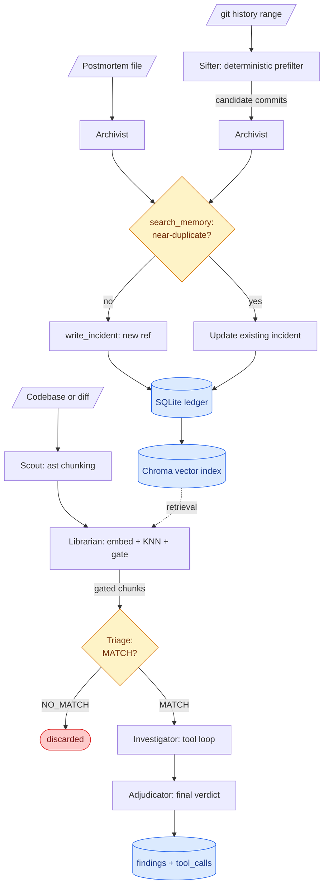

# Omen

> Turn a team's own incident history into a standing set of code reviewers — an agent that
> learns the *mechanism* behind a past failure (from a postmortem, or straight from `git`
> history) and later explains, with cited evidence, why a new chunk of code repeats it. Runs
> entirely against a local Gemma model; nothing leaves the machine.

A codebase forgets. A team hits an incident, writes a postmortem, fixes it — and eighteen
months later someone reintroduces the same failure mode written a different way. Linters can't
catch it, because the knowledge isn't a generic best practice, it's *this team's specific
history*. Grep can't catch it either, because the second occurrence rarely reuses the first
one's vocabulary — a Redis-token leak the first time, an in-process `functools.lru_cache` with
the same missing invalidation the second.

Omen is built around two commands that close that loop: `omen learn` forms a durable,
technology-agnostic memory of a failure; `omen scan` checks a codebase against every memory
learned so far. Both run against a local [Gemma][gemma] model served by [Ollama][ollama] —
deliberately, not incidentally: the material being read (proprietary source code, and
postmortems that describe an outage or vulnerability in detail) is exactly what a team can't
casually ship to a third-party API, and a local model makes an otherwise cost-prohibitive
multi-stage judging pipeline free to run per call.

[gemma]: https://ai.google.dev/gemma
[ollama]: https://ollama.com/

## Table of Contents

- [Features](#features)
- [Architecture](#architecture)
- [Quick start](#quick-start)
- [Usage walkthrough](#usage-walkthrough)
- [Commands](#commands)
- [Data model](#data-model)
- [Configuration](#configuration)
- [Tech stack](#tech-stack)
- [Testing](#testing)
- [Project structure](#project-structure)
- [Documentation](#documentation)

## Features

### Memory formation (`omen learn`)

- **Two input paths to the same memory.** `omen learn <postmortem.md>` reads a curated
  document; `omen learn --from-git <range>` reads raw commit history with no human-written
  summary at all — a deterministic Sifter prefilters the range by message pattern, revert
  detection, and sensitive-path signals before any model call happens.
- **Abstraction over description.** A learned incident records a technology-agnostic
  *mechanism* ("a permission cache has no invalidation path tied to the revocation event"),
  plus several concrete surface forms that deliberately span technologies the source incident
  never used — the single biggest lever on later retrieval quality.
- **Failure, not fix.** On the git path, the Archivist is prompted to reconstruct the
  *pre-change* state — a fix commit shows the remedy being added, not the bug that made it
  necessary.
- **Dedup before write.** Every write checks the ledger for a near-duplicate first
  (`search_memory`) and updates that entry instead of creating a redundant one.
- **A real undo.** `omen memory forget <ref>` removes an incident from both SQLite and the
  vector index — the safety valve that makes autonomous memory writes acceptable.

### Investigation (`omen scan`)

- **Deterministic scoping.** Defaults to the working-tree `git diff`; `--since <rev>` diffs a
  specific ref, `--all` scans the whole tracked tree. Files are chunked by `ast` into
  function/method/class-sized pieces, not fixed-size windows.
- **Retrieval before generation.** Chunks are embedded, queried against Chroma, collapsed to
  one best-variant candidate per incident, and gated below a calibrated similarity floor —
  entirely in pure Python, no model call yet.
- **Two-stage judgment, not one.** A fast, tool-free Triage pass rules `MATCH`/`NO_MATCH` on
  every gated chunk; only `MATCH` chunks proceed to the expensive, tool-driven Investigator, so
  agentic cost is spent where it can change the answer, not spent uniformly.
- **Evidence-backed final verdict.** The Adjudicator sees the chunk, the candidate incidents,
  and the Investigator's transcript — deliberately *not* Triage's reasoning or verdict, so it
  can't rubber-stamp the first stage's opinion.
- **A full audit trail.** Every tool call made during every investigation is recorded to
  SQLite (`tool_calls`), alongside per-run timing and per-finding evidence (`runs`,
  `findings`).

### Safeguards

- **Nothing self-confirms.** A `confirmed` verdict with no cited evidence lines is
  automatically downgraded to `unverified` in code, never left to the model's discretion.
- **Bounded agent loops.** Max tool calls per chunk, a duplicate-call cache, and a wall-clock
  ceiling are enforced in the orchestrator — never merely requested in a prompt.
- **Path confinement.** `read_code` and `grep_symbol` resolve paths against the scanned repo
  root and reject anything outside it.
- **A reversibility hedge on execution itself.** Every LLM role runs through a `RoleRunner`
  interface with two interchangeable backends (`--runner={adk,direct}`) — if Google ADK's
  structured-output or tool-calling path misbehaves, direct Ollama calls are a flag away, not a
  rewrite.

## Architecture

Omen runs **one** Gemma model, loaded once, with different prompts swapped in per role — it is
not several separate models. The pipeline's stage *order* is fixed, ordinary Python; agency is
spent *within* a stage — the Investigator decides which tools to call and when to stop, and the
Archivist decides whether what it's about to write is actually new.



### Roles

| Role | Mission | Tools | Job |
|---|---|---|---|
| **Sifter** | learn (git input only) | — (no LLM by default) | Reduce a commit range to a handful of candidates by message pattern, revert detection, and sensitive-path signals. |
| **Archivist** | learn | `read_file`/`read_commit`+`read_diff`, `search_memory`, `write_incident` | Abstract a failure into a technology-agnostic mechanism plus surface forms; dedup before writing. |
| **Scout** | scan | — | Resolve scope via `git`; `ast`-chunk files into reasoning-sized pieces. |
| **Librarian** | scan | — | Embed chunks, query the vector index, collapse to one candidate per incident, gate below threshold. |
| **Triage** | scan | — | Fast structured `MATCH`/`NO_MATCH` ruling. Default assumption is `NO_MATCH`; it has to be argued out of. |
| **Investigator** | scan (Triage `MATCH` only) | `read_code`, `grep_symbol`, `search_memory`, `get_incident` | Agentic evidence gathering — is there a mitigation elsewhere, is this code actually reachable on the path that matters. |
| **Adjudicator** | scan | — | Final `confirmed`/`rejected`/`unverified` verdict from the investigation transcript, blind to Triage's reasoning. |

### Control flow

Order is deterministic Python end to end; only what happens *inside* a stage is agentic. This
is a deliberate position, not a shortcut — on constrained hardware every routing decision costs
a real inference, and the pipeline shape is fully known ahead of time. Autonomy is spent where
the steps are genuinely unknown in advance (which tools to call, how many, whether a memory is
actually new); determinism is kept everywhere the shape doesn't change.

### Two execution backends

Every role runs through a `RoleRunner` interface (`omen/runners.py`):

- **`ADKRoleRunner`** (default) — [Google's Agent Development Kit][adk], via
  `LiteLlm("ollama_chat/…")`.
- **`DirectOllamaRunner`** — talks to Ollama directly (`format=<schema>` for constrained
  structured output, native `tools=[...]` for tool calling).

Selectable per-command with `--runner={adk,direct}`; both are fully implemented and tested
equally, not one real path and one stub.

[adk]: https://google.github.io/adk-docs/

### The chokepoint modules

Four modules each isolate one reversible decision, so a change of mind in any of them never has
to ripple elsewhere:

| Module | Owns | Escape hatch |
|---|---|---|
| `omen/config.py` | Which Gemma model is named | Swap model in one line |
| `omen/runners.py` | `RoleRunner` protocol: ADK vs. direct-Ollama execution | `--runner=direct` bypasses ADK entirely |
| `omen/agents.py` | The only module that imports `google.adk` | Nothing else may import it |
| `omen/vectors.py` | The only module that imports `chromadb`, owns distance→similarity conversion | No unhardened client, no raw distances downstream |

## Quick start

Prerequisites: Python 3.11, and [Ollama](https://ollama.com/) installed and running.

```bash
git clone <this-repo>
cd Local-lore

py -3.11 -m venv .venv
.venv\Scripts\activate            # Windows; use `source .venv/bin/activate` on macOS/Linux
pip install -r requirements.txt

ollama pull gemma4:12b-it-q4_K_M
ollama pull embeddinggemma
```

If you're on a GPU-constrained card, model loading matters: Ollama can silently split the model
across CPU/GPU and tank throughput unless it's told to keep the whole model resident on GPU.
`omen/config.py` is the one place model and runtime flags (`NUM_GPU`, `NUM_CTX`,
`THINK_DEFAULT`) live — see [Configuration](#configuration).

## Usage walkthrough

1. **Bootstrap the ledger.** Load the starter incident set and build its vector index:

   ```bash
   python -m omen.cli seed incidents.yaml
   python -m omen.cli reindex
   python -m omen.cli memory list
   ```

   You should see the seeded incidents printed with their refs (`OMEN-001`, `OMEN-002`, ...).

2. **Teach it something new**, from a postmortem or from raw history:

   ```bash
   python -m omen.cli learn postmortems/some-incident.md
   python -m omen.cli learn --from-git HEAD~40..HEAD --dry-run   # preview candidates first
   ```

3. **Scan a codebase** against everything currently in memory:

   ```bash
   python -m omen.cli scan path/to/a/repo
   ```

   Defaults to diffing the working tree; pass a directory and `--all` to scan every tracked
   file instead. `--dry-run` stops after chunking, `--retrieval-only` stops after ranking
   candidates — both skip every model call, useful as a fast sanity check.

4. **Undo a bad memory** if `learn` got something wrong:

   ```bash
   python -m omen.cli memory forget OMEN-007
   ```

### Try it on the bundled demo

`demo_repo/` is a small, self-contained example service — its own nested git repo (only
`demo_repo/.git/` is ignored by this repo; its *files* are tracked normally) — built to
exercise both commands end to end:

- **A planted true positive** (`permissions.py`): a `functools.lru_cache`'d permission check
  with no invalidation on revoke. It shares OMEN-001's failure mechanism with none of its
  vocabulary — no Redis, no TTL.
- **A hard negative** (`cache/response_cache.py`): a genuine cache, with "cache" in every
  identifier, mechanically unrelated — it caches a static response body, nothing
  authorization-related.
- **A small constructed commit history** — one real fix commit plus keyword-avoiding decoys —
  for trying `--from-git` end to end.

```bash
python -m omen.cli scan demo_repo --all
python -m omen.cli learn --from-git HEAD --repo demo_repo --dry-run   # drop --dry-run to actually learn
```

## Commands

All commands go through `python -m omen.cli <command>`.

| Command | What it does |
|---|---|
| `omen seed <incidents.yaml>` | Loads a YAML file of incidents into the SQLite ledger. Used once to bootstrap a starter memory set. |
| `omen reindex` | Rebuilds the Chroma vector index from SQLite. SQLite is always the source of truth; Chroma is a derived index you can throw away and rebuild any time. |
| `omen memory list` | Lists every incident currently in the ledger, with its ref and how it was learned. |
| `omen memory forget <ref>` | Deletes an incident from both SQLite and the vector index — the undo for a bad `omen learn` run. |
| `omen learn <postmortem.md>` | Reads a postmortem file and forms a new memory (or updates a near-duplicate one) from it. |
| `omen learn --from-git <range>` | Reads raw commit history (e.g. `HEAD~40..HEAD`): the Sifter narrows the range to candidates, then each is turned into a memory. `--repo <path>` picks which repo to read (default: cwd); also takes `--max-commits`, `--max-learn`, `--dry-run`. |
| `omen scan <path>` | Runs the full investigation pipeline and prints a verdict per flagged chunk. `--dry-run` stops after chunking; `--retrieval-only` stops after ranking candidates (no generation); `--since <rev>` diffs a specific ref; `--all` scans the whole tracked tree. |
| `omen calibrate` | Sweeps the retrieval similarity threshold over a labeled fixture set and prints where true positives stop surviving and hard negatives start getting rejected. A tuning tool for `SIMILARITY_THRESHOLD`, not part of the normal learn/scan workflow. |

`learn` and `scan` both also take `--runner={adk,direct}` — see
[Two execution backends](#two-execution-backends).

`learn` is the only command that writes to the ledger — every `write_incident` call
immediately re-embeds and rebuilds the vector index, so a freshly learned incident is
retrievable by the very next `scan` with no manual `reindex` needed. `seed`/`reindex` bootstrap
and repair that same ledger by hand; `memory list`/`forget` let you inspect and undo what's in
there; `calibrate` is a standalone tuning loop against a fixture file, independent of the real
ledger.

## Data model

**SQLite (`omen/store.py`) is the source of truth.** Chroma (`omen/vectors.py`) is a *derived*
index, rebuildable at any time via `omen reindex` — nothing ever writes to it directly.

| Table | Holds |
|---|---|
| `incidents` | The abstracted `failure_mechanism`, `what_happened`, and `the_rule` for each learned incident, plus provenance (`source`, `learned_by`). |
| `surface_forms` | Concrete manifestations of an incident's mechanism, embedded separately — the single biggest retrieval lever. |
| `chunk_vectors` | A content-hash cache of computed chunk embeddings. Exact-key lookup only, never a similarity search. |
| `runs` | One row per `scan`/`learn` invocation: timing, counts, which runner. |
| `findings` | One row per flagged chunk: verdict, mechanism, reasoning, evidence, similarity. |
| `tool_calls` | The full audit trail of every tool call made during every investigation. |

`learned_by` distinguishes a memory a human seeded (`seed`) from one the agent formed, and
which input path formed it (`archivist:postmortem` vs. `archivist:git`); `source` carries the
postmortem path or commit SHA so any learned memory is traceable back to where it came from.

Chroma holds one vector per **embedded variant** — an incident's mechanism sentence plus each
of its surface forms — so an incident's retrieval score is the max over its variants.
`hnsw:space` is set to cosine explicitly (Chroma defaults to L2), and the collection is
constructed with `embedding_function=None` and `Settings(anonymized_telemetry=False)`, or it
will silently try to download a default embedding model and phone home telemetry.

## Configuration

Everything tunable lives in `omen/config.py` — the single chokepoint for which model is named
and how the runtime talks to it.

| Setting | Default | Why |
|---|---|---|
| `LLM_MODEL` | `gemma4:12b-it-q4_K_M` | The reasoning model for every agent role. |
| `EMBED_MODEL` | `embeddinggemma` | Chunk and incident embeddings. |
| `NUM_GPU` | `999` | Forces full GPU residency. Without it, Ollama silently splits the model across CPU/GPU and generation drops to ~5 tok/s. |
| `NUM_CTX` | `4096` | Fits fully on an 8GB card; `8192` does not. |
| `TEMPERATURE` | `0` | Applied to every role — determinism, not just Triage. |
| `THINK_DEFAULT` | `False` | Off for latency-sensitive structured roles (Triage, Adjudicator): Gemma 4's "thinking" mode costs ~8x latency for no observed quality gain on these prompts. |
| `SIMILARITY_THRESHOLD` | `0.35` | The Librarian's retrieval floor, chosen by `omen calibrate` against `fixtures/fixtures.yaml`. |
| `MAX_TOOL_CALLS` / `TOOL_WALL_CLOCK_SECONDS` | `6` / `90` | Hard caps on an Investigator's tool loop, enforced in code. |
| `MAX_COMMITS` / `MAX_LEARN` | `50` / `5` | Bounds on `omen learn --from-git`: how many commits the Sifter considers, and how many candidates the Archivist actually processes. |

Adjust `LLM_MODEL`, `NUM_GPU`, and `NUM_CTX` here for different hardware — nothing elsewhere in
the codebase names a model or a GPU flag directly.

## Tech stack

| Layer | Choice |
|---|---|
| Language | Python 3.11 |
| Agent orchestration | Google [ADK][adk] (`LlmAgent` per role) via LiteLLM, behind a `RoleRunner` abstraction with a direct-Ollama fallback |
| Local LLM runtime | Ollama, `gemma4:12b-it-q4_K_M` |
| Embeddings | Ollama, `embeddinggemma` |
| Vector store | ChromaDB, `PersistentClient`, telemetry off |
| Structured contracts | Pydantic |
| Persistence | SQLite (ledger, runs, findings, tool-call audit trail) |
| Chunking | Python `ast` (no parser dependency) |
| Testing | Pytest, pytest-asyncio |

No paid API is required anywhere in the stack.

## Testing

```bash
pytest                      # full suite (~5-6 min); most tests hit a live Ollama instance
pytest tests/test_scout.py  # fast, no model required
pytest tests/test_triage.py # the fixture precision/recall gate
```

Tests that require live inference are written that way deliberately — prompt quality for a
system like this can't be meaningfully verified with mocks, so most of the suite exercises the
real model rather than stubbing it out; those tests skip gracefully when Ollama isn't
reachable.

## Project structure

```
omen/
├── omen/
│   ├── cli.py          # argparse + asyncio.run; the deterministic orchestrator
│   ├── contracts.py    # pydantic models — no logic, no third-party imports
│   ├── config.py       # only place models/runtime flags are named
│   ├── agents.py       # only place google.adk is imported
│   ├── runners.py      # RoleRunner protocol + ADKRoleRunner + DirectOllamaRunner
│   ├── tools.py        # tool functions + path confinement + call caps
│   ├── store.py        # SQLite: ledger, cache, runs, findings, tool_calls
│   ├── vectors.py      # only place chromadb is imported; owns distance→similarity
│   ├── scout.py        # git scope resolution + ast chunking
│   ├── librarian.py    # embed (cached) + query + collapse + gate
│   ├── sifter.py        # deterministic commit-range prefilter for --from-git
│   ├── archivist.py     # the learn mission
│   ├── fixtures.py      # loads fixtures/fixtures.yaml for calibrate/tests
│   └── report.py        # progress lines, terminal summary
├── prompts/              # triage, investigator, adjudicator, archivist (per input path)
├── incidents.yaml        # the seeded starter ledger
├── postmortems/           # raw markdown for `omen learn` to consume
├── fixtures/              # labeled chunks + expected verdicts, for calibrate/tests
├── demo_repo/             # self-contained example service used above
└── tests/
```

## Documentation

- [PLAN.md](PLAN.md) — full design rationale, the original 8-hour build plan, and the track
  alignment writeup.
- This README — commands, architecture, configuration, and how to run the project day to day.
